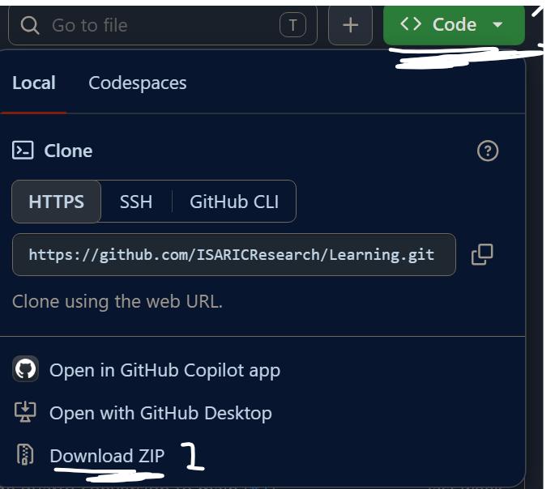

```{=typst}
#set text(font: "Calibri", size: 11pt)

#let primary-color = rgb("#ba0225")
#let secondary-color = rgb("#475160")

// Style links with secondary color
#show link: it => {
  text(fill: secondary-color, weight: "bold", it)
}

// Create colored left margin background with primary and secondary stripes
#set page(
  margin: (top: 2cm, bottom: 2.5cm, left: 3.5cm, right: 2cm),
  background: place(
    top + left,
    box(
      width: 1.8cm,
      height: 100%,
      fill: primary-color
    )
  ) + place(
    top + left,
    dx: 1.2cm,
    box(
      width: 0.6cm,
      height: 100%,
      fill: secondary-color
    )
  )
)

// Style course table with primary color header and alternating rows
#show table: it => {
  set table(
    columns: (auto, 2fr, 3fr),
    fill: (x, y) => {
      if y == 0 { primary-color }
      else if calc.even(y) { rgb("#f5f5f5") }
      else { white }
    },
    stroke: (x, y) => {
      if y == 0 { (bottom: 2pt + primary-color) }
      else { (bottom: 0.5pt + rgb("#e0e0e0")) }
    }
  )
  it
}

// Title page - centered
#align(center)[
  #v(3cm)
  
  #block(width: 90%, fill: primary-color, inset: 30pt)[
    #text(size: 24pt, weight: "bold", fill: white)[CREDO Learning: Getting Started]
  ]
  
  #v(1em)
  
  #block(width: 90%, fill: secondary-color, inset: 25pt)[
    #text(size: 14pt, fill: white)[Introduction to Statistics for Clinical Research]
  ]
  
  #v(3cm)
  
  #text(size: 12pt)[
    ISARIC – International Severe Acute Respiratory and emerging Infection Consortium
  ]
]

#v(1fr)

#pagebreak()

#set align(left)
```

## Getting Started

This guide provides step-by-step instructions for downloading and setting up the CREDO Learning course materials on your computer.

## Step 1: Download the Repository

Follow these steps to download the course materials as a ZIP file from GitHub:

**GitHub Repository:** [https://github.com/ISARICResearch/Learning](https://github.com/ISARICResearch/Learning)



**Steps to Download:**

1. **Navigate to the GitHub repository** - Visit [https://github.com/ISARICResearch/Learning](https://github.com/ISARICResearch/Learning)
2. **Click the "Code" button** - Located near the top-right of the repository
3. **Select "Download ZIP"** - Choose this option from the dropdown menu
4. **Save to your computer** - Choose a location where you want the files (e.g., Desktop or Documents)
5. **Extract the ZIP file** - Right-click the downloaded file and select "Extract All" (Windows) or double-click (Mac/Linux)

After extraction, you'll have a folder containing all course materials.

## Step 2: Install Required Software

Before running the course materials, you'll need to install R and Quarto (if not already installed):

| Software | Download Link |
|----------|---------------|
| R | [https://www.r-project.org/](https://www.r-project.org/) |
| Quarto | [https://quarto.org/docs/get-started/](https://quarto.org/docs/get-started/) |
| (Very important) RStudio / Positron | [https://posit.co/download/rstudio-desktop/](https://posit.co/download/rstudio-desktop/) |

## Step 3: Quick Start

Once you have the extracted files and required software installed:

**Open R or RStudio/Positron**

Navigate to the extracted course folder

Run this command:

```r
source("setup_packages.R")
```

This single command will:

- ✓ Install all required packages
- ✓ Generate PDF files for all course modules
- ✓ Generate PDF files for all reference guides
- ✓ Complete setup in approximately 5-10 minutes

## What You'll Have After Setup

After running the setup command, you'll have:

- **8 Course Modules** - Comprehensive statistics education from R basics through survival analysis
- **9 Reference Guides** - Quick-reference PDFs on pipes, functions, model comparison, and more
- **Executable Code** - All .qmd source files ready to modify and run
- **Complete Materials** - All PDFs ready to read and study immediately

## Course Overview

The course is organized sequentially for maximum learning:

::: {.course-table}
| Module | Title | Focus |
|--------|-------|-------|
| 0 | Basic R Programming | Essential R skills and type safety |
| 1 | Descriptive Statistics | Data exploration and visualization |
| 2 | Populations and Samples | Sampling and inference concepts |
| 3 | Probability and Confidence Intervals | Uncertainty quantification |
| 4.1 & 4.2 | Hypothesis Testing | Statistical testing frameworks |
| 5 | Linear & Logistic Regression | Modeling relationships |
| 6 | Survival Analysis | Time-to-event data analysis |
:::

## Troubleshooting

### Issue: "R is not installed"

Solution: Download and install R from https://www.r-project.org/ before running setup_packages.R

### Issue: "Package installation failed"

Solution: Ensure you have a stable internet connection and sufficient disk space. The setup script will attempt to install only missing packages.

### Issue: "PDF files were not generated"

Solution: Verify Quarto is installed (quarto.org/docs/get-started/). Run `source("renderer.R")` manually to generate PDFs.

## Need Help?

- Review the comprehensive README.md file in the course folder
- Check individual module documentation files
- Consult the reference guides (PIPE_OPERATORS_GUIDE.pdf, R_FUNCTIONS_GUIDE.pdf)
- All course materials include inline comments and explanations

---

**CREDO Learning - Open Educational Resources for Clinical Research**

[ISARIC – International Severe Acute Respiratory and emerging Infection Consortium](https://isaric.org/)
